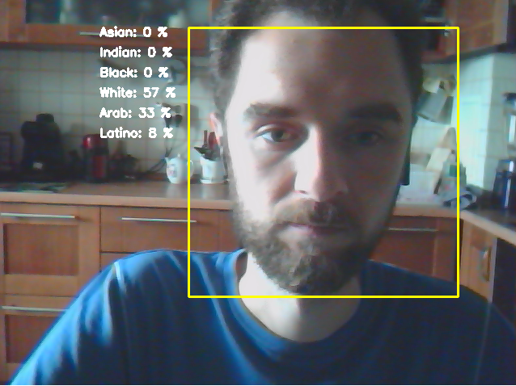

# Определение расовой принадлежности в реальном времени используя DeepFace и OpenCV  
В данном проекте с помощью веб-камеры мы определим с какой вероятностью человек принадлежит к той или иной расе.  

Для определения вероятностей принадлежности используется легковесная opensource библиотека DeepFace для распознавания лиц и извлечения аттрибутов.  

В строке инициализации модели 
`res = DeepFace.analyze(frame, actions = ['race'], enforce_detection=False)` также можно узнать возраст, пол, эмоцию человека ('age', 'gender', 'emotion').  

В результате выполнения получим следующий список:  
`{'race': {'asian': 10.353447496891022, 'indian': 3.11336237937212, 'black': 5.626671388745308, 'white': 46.71965837478638, 'middle eastern': 13.332343101501465, 'latino hispanic': 20.85452526807785}, 'dominant_race': 'white', 'region': {'x': 0, 'y': 0, 'w': 480, 'h': 640}}`  

После приведения в нагладную форму получим результат.

# Результат работы программы:  
  
